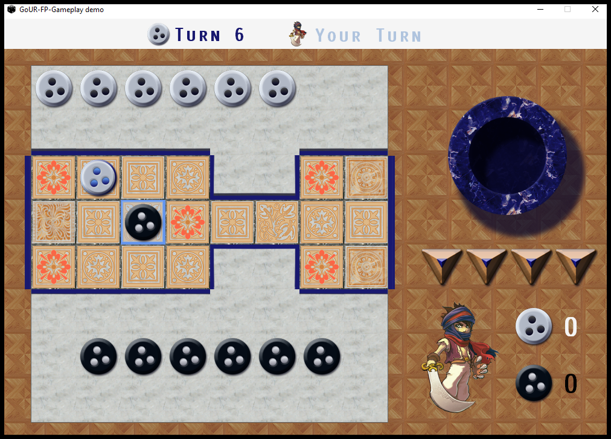

# The Royal Game of Ur

## Introduction
Game of Ur is a top-down, isometric, turn-based strategy game, exclusively for PC, which assigns players to play vs a computer opponent.

## Background
Game of Ur is a board game based on gameboards found during the excavations carried out by an archaeologist called, Leonard Woolley, at the ancient Sumerian city of Ur, inside the royal tombs ( The royal game of Ur , 1928) . Above boards dated back to approximately 2600BC. However, rules of the game was not clear, till an ancient Babylonian tablet, shed some light by describing the rules of the game, which dated back to 177BC, making it the oldest known rules set for a board game.( Tablet , no date) 

## Description
After pressing a new game, you select the basic game mode, which is the only game mode available for the moment. You closely read the screen guidelines and observe the gameboard, seven dotted game pieces and four pyramid dice. You note that each dice has two pips.
You take the first turn and roll the dice. You rolled two pips facing top, therefore, you move a dotted piece to the second square by selecting it. Computer opponent rolled three, therefore a dotted piece has been moved to the third square from the starting position. You roll the dice again and get all four pips facing top!You move another dotted piece directly to the fourth square by selecting it. Since the forth
square is a rosette, your game piece is now safe from the opponent as long as it stays on this square. Since you landed on a rosette, you also get an extra turn. You roll again...
After a while you managed to get five of your pieces around and off the board and your opponent only managed to get two of the pieces off the board. You continue to race to your victory...
AKASHAD!  You shouted. Which means, “I Conquer!”.

## Key features
* Race game mode for fun!
  Game of Ur has realized the “Race game” mode for fast-paced and immensely fun gameplay, especially for kids. You can play this game mode versus a computer or a human opponent, using fourteen dotted game pieces, four pyramid dice.
* Points game mode for a greater challenge!
  This game mode is slow-paced, strategical and provides a greater challenge for you. It requires ten numbered game pieces, colored betting counters and four pyramid dice. Colored betting counters represents points and your goal is to win the most of them, and score the highest points, by the end of three rounds. Be sure to read the rules well as they are the oldest game rules ever known to humans!
* Lots of practical rewards!
  As you progress through the game, many rewards will be unlocked for you, such as, new game modes, gameboards, game pieces, music and much more!
* Two player support with split screen!
  Game of Ur enables you to play the game with a buddy via split screen and keyboard sharing, just like No need of network connections or additional PCs!
  
## Screenshots

